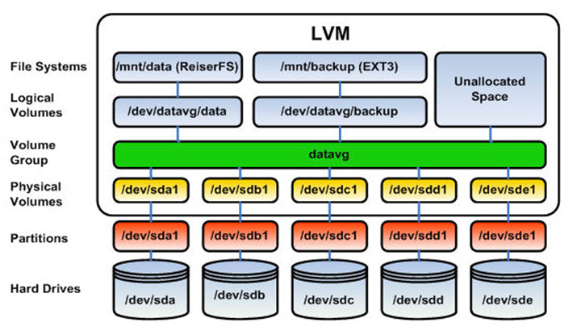
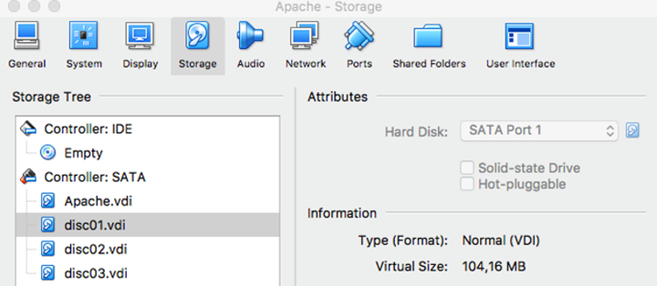

# Guia bàsica de LVM (Logical Volume Manager)

## Introducció

LVM (Logical Volume Manager) és una eina de gestió d'emmagatzematge que permet crear, redimensionar i gestionar volums lògics de manera flexible en sistemes Linux. Aquesta guia proporciona una introducció bàsica a LVM, incloent els conceptes clau i els passos per configurar-lo.

Hem d'entendre que LVM és una capa d'abstracció entre el sistema operatiu i els dispositius d'emmagatzematge físics, permetent als administradors gestionar l'espai d'emmagatzematge de manera més eficient i flexible. Aporta avantatges com la possibilitat de redimensionar volums sense necessitat de reiniciar el sistema, crear instantànies per a còpies de seguretat i combinar diversos dispositius d'emmagatzematge en un únic espai lògic.

## Conceptes clau

- **Physical Volume (PV)**: Un disc físic o una partició que s'utilitza com a base per a LVM. Es pot crear un PV a partir d'un disc dur, una partició o un dispositiu de bloc.

- **Volume Group (VG)**: Un grup de volums que combina diversos PVs en un únic espai d'emmagatzematge. Els VGs permeten gestionar l'espai de manera més flexible.

- **Logical Volume (LV)**: Un volum lògic creat dins d'un VG. Els LVs es poden redimensionar i gestionar de manera independent, permetent una major flexibilitat en la gestió de l'emmagatzematge.



## Exemple pràctic sobre VM

### Inicialització volums físics

El primer pas, serà crear els discos virtuals que utilitzarem, per exemple, es poden crear tres discos virtuals de 1GB cadascun. Un cop creats, es connectaran a la màquina virtual.



Un cop arrencada la màquina virtual, podem comprovar que els discos han estat reconeguts pel sistema amb la comanda `lsblk` o amb `fdisk -l`. Això ens mostrarà els dispositius de bloc disponibles, incloent els discos virtuals que hem creat, el disc principal serà `/dev/sda` i els discos virtuals seran `dev/sdb`, `dev/sdc` i `dev/sdd`.

Ara cal crear els volums físics amb la comanda pvcreate (physical volume create) a partir de les particions desitjades.

```bash
sudo pvcreate /dev/sdb
sudo pvcreate /dev/sdc
sudo pvcreate /dev/sdd
```

### Creació i gestió del grup de volums

El grup de volums és la capa on s’unifiquen els diferents discos físics per tal de tenir un espai base on es crearan els volums lògics. Es pot entendre com un contenidor que agrupa els volums físics i que per tant, agrupa l’espai d’emmagatzematge disponible. Per crear un grup de volums, utilitzarem la comanda vgcreate (volume group create) i li donarem un nom al grup de volums, per exemple `vg1`.

```bash
sudo vgcreate vg1 /dev/sdb /dev/sdc
```

Un cop creat el grup, no és un element immutable, sinó que es poden afegir o eliminar volums físics del grup de volums amb les comandes `vgextend` i `vgreduce`, respectivament.

Per exemple, per afegir el tercer volum físic al grup de volums, utilitzarem la comanda `vgextend`:

```bash
sudo vgextend vg1 /dev/sdd
```

Si ara volguessem eliminar el tercer volum físic del grup de volums, utilitzarem la comanda `vgreduce`:

```bash
sudo vgreduce vg1 /dev/sdd
```

Per veure la informació del grup de volums, podem utilitzar la comanda `vgdisplay` o `vgs`. La diferència és que `vgdisplay` mostra informació detallada dels grups de volums disponibles   , mentre que `vgs` mostra la informació de manera resumida.

> 🔔 És bona idea provar totes dues comandes, per veure les diferències i ens quins casos es més útil usar una o l'altra.

### Creació i gestió de volums lògics

Els volums lògics es creen a partir del VG indicant la mida, el VG i el nom que se li vol donar amb la comanda `lvcreate` (logical volume create). Per exemple, per crear un volum lògic de 1GB dins del grup de volums `vg1` amb el nom `lv1`, utilitzarem la següent comanda:

```bash
sudo lvcreate -L 1G -n lv1 vg1 # -L per la mida, -n pel nom
```

Si ara es consulta la informació del grup de volums `vgdisplay vg1`, es podrà veure que s'ha creat un volum lògic de 1GB dins del grup de volums `vg1`. També es pot utilitzar la comanda `lvs` per veure els volums lògics disponibles.

Un cop creat el volum lògic, cal formatar-lo amb un sistema de fitxers per poder utilitzar-lo. Per exemple, podem formatar el volum lògic `lv1` amb el sistema de fitxers ext4 utilitzant la comanda `mkfs.ext4`:

```bash
sudo mkfs.ext4 /dev/vg1/lv1
```

> 💡La comanda `mkfs` permet formatejar el volum amb el sistema de fitxers desitjat: ext4, xfs, btrfs, exfat, ntfs, etc.

Un cop formatat el volum cal muntar-lo en el sistema de fitxers per poder accedir-hi. Per exemple, podem muntar el volum lògic `lv1` en el directori `/mnt/lv1` utilitzant la comanda `mount`:

```bash
sudo mkdir -p /mnt/lv1
sudo mount /dev/vg1/lv1 /mnt/lv1
```

L’inconvenient és que caldria fer aquesta acció cada cop a l’iniciar la màquina, per evitar això, es pot afegir una entrada al fitxer `/etc/fstab` per muntar el volum automàticament a l’inici del sistema. Per exemple, afegint la següent línia al fitxer `/etc/fstab`:

```text
/dev/vg1/lv1 /mnt/lv1 ext4 defaults 0 0
```

Per aplicar els canvis sense reiniciar, es pot utilitzar la comanda `sudo mount -av`:

Com s'ha comentat anteriorment, una de les grans avantatges de LVM és la possibilitat de redimensionar els volums lògics sense necessitat de reiniciar el sistema. Per exemple, si volem augmentar la mida del volum lògic `lv1` a 2GB, podem utilitzar la comanda `lvresize` o `lvextend`. Per exemple, per augmentar la mida del volum lògic `lv1` a 2GB, utilitzarem la comanda següent:

```bash
sudo lvresize -L 2G /dev/vg1/lv1 #fixa nova mida
sudo lvextend -L +1G /dev/vg1/lv1 #augmenta 1GB
```

**❗Abans de modificar un volum lògic sempre s’ha desmuntar perquè no estigui en ús (umount /mnt/lv1).**

Un cop redimensionat el volum lògic, cal redimensionar el sistema de fitxers per tal que ocupi tot l'espai disponible.

```bash
sudo e2fsck -f /dev/vg1/lv1 #comprova el sistema de fitxers abans de redimensionar
sudo resize2fs /dev/vg1/lv1 #redimensiona el sistema de fitxers
```

També es pot reduir la mida d'un volum lògic, però cal tenir en compte que això pot provocar pèrdua de dades si no es fa correctament. Per reduir la mida d'un volum lògic, primer cal reduir el sistema de fitxers i després reduir el volum lògic. Per exemple, per reduir el volum lògic `lv1` a 500MB, utilitzarem les següents comandes:

```bash
sudo umount /mnt/lv1 #desmunta el volum lògic
sudo e2fsck -f /dev/vg1/lv1 #comprova
sudo resize2fs /dev/vg1/lv1 500M #redimensiona el sistema de fitxers
sudo lvreduce -L 500M /dev/vg1/lv1 #redueix el volum lògic
```

Si es vol eliminar un volum lògic, primer cal desmuntar-lo i després utilitzar la comanda `lvremove`. Per exemple, per eliminar el volum lògic `lv1`, utilitzarem les següents comandes:

```bash
sudo umount /mnt/lv1 #desmunta el volum lògic
sudo lvremove /dev/vg1/lv1 #elimina el volum lògic
```

> 💡Si s'ha configurat l'arxiu `/etc/fstab` per l'automuntatge del volum lògic, cal esborrar l'entrada abans d'eliminar el volum.

### Snapshots (instantànies)

El concepte de snapshot (instantània) és una característica molt útil de LVM que permet crear una còpia de seguretat d'un volum lògic en un moment determinat. La idea és similar a la instantània que es pot fer d'una màquina virtual.

L'ús d'instantànies és especialment útil per a còpies de seguretat, proves de programari o qualsevol situació en què es necessiti un punt de restauració. Les instantànies permeten capturar l'estat d'un volum lògic sense interrompre el seu funcionament.

> 🔔 Crear una instantània és una acció pràcticament immediata, mentre que fer una còpia de seguretat no. Per això és molt important usar aquesta tècnica per exemple en còpies de seguretat de bases de dades, perquè evitem haver d'aturar-la (si la BD es modifica mentre s'està fent la còpia, es pot produir un problema de consistència de les dades).

Per fer una instatània d'un volum lògic, utilitzarem la comanda `lvcreate` amb l'opció `-s`. Per exemple, per crear una instantània del volum lògic `lv1` amb el nom `lv1_snapshot`, utilitzarem la següent comanda:

```bash
sudo lvcreate -L 500M -s -n lv1_snapshot /dev/vg1/lv1
```

Aquí cal indicar:

- La mida de l'instantània (en aquest cas, 500MB). Aquesta mida ha de ser suficient per emmagatzemar els canvis que es facin al volum original mentre l'instantània estigui activa. Això dependrà del tipus d'ús del volum original i de la quantitat de dades que es modifiquin durant el període en què es mantingui l'instantània, habitualment entre el 10 i el 50% de la mida del volum original.
- El nom de l'instantània (`lv1_snapshot`).
- El volum lògic original del qual es vol crear la instantània (`/dev/vg1/lv1`).

Un cop feta la còpia de seguretat, es pot eliminar la instantània amb la comanda `lvremove`. Per exemple, per eliminar la instantània `lv1_snapshot`, utilitzarem la següent comanda:

```bash
sudo lvremove /dev/vg1/lv1_snapshot
```

Pel contrari, si el que es vol és restaurar el volum original a l'estat de l'instantània, s'usarà la comanda `lvconvert --merge`. Per exemple, per restaurar el volum lògic `lv1` a l'estat de l'instantània `lv1_snapshot`:

```bash
sudo lvconvert --merge /dev/vg1/lv1_snapshot
```

> ❗Aquestes operacions s'han de fer amb els volums desmuntats, ja que no es poden fer canvis en un volum lògic mentre està en ús.

### Volum mirall (mirrored volume)

Idea similar a un RAID 1 però a nivell de volums lògics. Proporciona redundància contra fallades físiques (sempre i quan es treballi amb més d'un disc físic).

Partim d'un escenari amb els volums físics creats, però cap grup de volums. El primer pas, serà crear el grup de volums amb els volums físics disponibles. Per exemple, per crear un grup de volums `vg_mirror` amb els volums físics `/dev/sdb` i `/dev/sdc`, amb la següent comanda:

```bash
sudo vgcreate vg_mirror /dev/sdb /dev/sdc
```

A continuació, es crearà un volum lògic mirall amb la comanda `lvcreate` amb l'opció `-m`. Per exemple, per crear un volum lògic mirall de 750 MB amb el nom `lv_mirror` dins del grup de volums `vg_mirror`, cal usar la següent comanda:

```bash
sudo lvcreate -L 750M -m 1 -n lv_mirror vg_mirror
```

El paràmetre `-m 1` indica que es vol crear un volum mirall amb una còpia de seguretat (mirroring) del volum original. Això significa que les dades escrites al volum lògic `lv_mirror` es duplicaran automàticament en el segon volum físic del grup de volums, es poden crear més miralls indicant un número més gran, per exemple `-m 2` crearia dos miralls.

> 💡La gestió del LVM es menja part de l'espai. Es pot comprovar amb `vgdisplay` com la mida disponible és una mica inferior a la suma dels dos volums físics.

## Enllaços d'interès

- [LVM HOWTO](https://tldp.org/HOWTO/LVM-HOWTO/)

-[Un pingüino en mi servidor - LVM para torpes (I)](https://blog.inittab.org/administracion-sistemas/lvm-para-torpes-i/)

- [Un pingüino en mi servidor - LVM para torpes (II)](https://blog.inittab.org/administracion-sistemas/lvm-para-torpes-ii/)

- [Un pingüino en mi servidor - LVM para torpes (III)](https://blog.inittab.org/administracion-sistemas/lvm-para-torpes-iii/)
