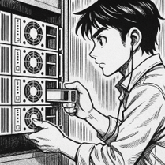

# NF2AA2. Emmagatzematge redundant

## Presentació de l'activitat

La informació és un dels béns més valuosos per qualsevol organització, en aquest cas, agafaràs el rol d'un tècnic d'una consultora tecnològica, EverPia, que ha estat contractada per un bufet d'advocats amb dades altament sensibles. L'objectiu és revisar i optimitzar el seu sistema d'emmagatzematge de dades, ja que l'actual és vulnerable a fallades i pèrdua d'informació.

La direcció del client ha expressat la necessitat urgent de renovar els seus sistemes de servidors per garantir que la informació estigui protegida contra fallades de disc i que l'espai pugui ser ampliat sense interrupcions.

Com a tècnics d'EverPia, teniu l'encàrrec de dissenyar i documentar les solucions d'emmagatzematge que compliran aquests requisits tant en entorns Linux com Windows. Aquest disseny permetrà presentar al client una proposta de solució.

L'objectiu principal és dissenyar i documentar dues solucions d'emmagatzematge (una per servidors Linux i una per servidors Windows) que compleixin amb els principis d'alta disponibilitat, redundància i escalabilitat per al client. Com ha de ser una prova de concepte, no treballareu amb servidors, sinó que, per facilitat, usareu màquines virtuals de sistemes operatius clients per documentar els procediments.

### Durada de l'activitat

La durada estimada de l'activitat és de 5 hores.

### Objectius de l'activitat

Entendre el funcionament dels espais d'emmagatzematge a Windows i la seva utilitat per millorar el rendiment i la tolerància a fallades.

### Competències treballades

n) Mantenir un esperit constant d’innovació i actualització en l’àmbit del sector informàtic.

### Resultats d'aprenentatge i criteris d'avaluació

RA2. Gestiona dispositius d'emmagatzematge descrivint els procediments efectuats i aplicant tècniques per assegurar la integritat de la informació.

2.2 Té en compte factors inherents a l’emmagatzematge de la informació (rendiment, disponibilitat, accessibilitat, entre d’altres)..

### Continguts

- Sistemes d'emmagatzematge redudants.

### Capacitats clau

- Autonomia
- Organització del treball
- Responsabilitat
- Resolució de problemes

## Enunciat de l'activitat

### 1. LVM amb Zorin OS

S'ha d'utilitzar la distribució Zorin OS (o una alternativa Linux compatible) per demostrar la utilitat del Logical Volume Manager (LVM).

Requisits de la Implementació i Demostració:

- Configuració Inicial: Crear un grup de volums (VG) i un volum lògic (LV) utilitzant inicialment un mínim de dos discs durs de 10 GB de capacitat. Aquest volum haurà estar formatat i muntat automàticament al sistema mitjançant l’edició de l’arxiu `/etc/fstab`.

- Alta Disponibilitat: Implementar la configuració d’un mirall (lvm_mirror) que protegeixi la informació davant la fallada d'un disc.

- Instantànies (snapshots):  Crear i afegir dos discos de 10 GB al grup de volums. Crear un volum (lvm_dades) amb el primer disc afegit, formatar-lo i muntar-lo. A continuació afegir arxius al volum (poden ser imatges d’Internet). Usar el segon disc afegit per crear un snapshot (lv_snapshot) i documentar com es pot restaurar aquest snapshot, si per exemple, la informació del volum original es danyés.

- Escalabilitat: Demostrar el procés d'ampliació. Usar l’espai que quedi lliure dins el grup de volums per ampliar el volum lv_dades.

### 2. Espais d'emmagatzematge a Windows 11

S'ha d'utilitzar Windows 11 per demostrar les configuracions possibles mitjançant els Espais d'Emmagatzematge (Storage Spaces).

Requisits de la Implementació i Demostració:

- Configuració inicial: Creació d'un Storage Pool: Crear un pool d'emmagatzematge inicialment amb tres discos de 10 GB (simulats).

- Estudi de Configuracions: Demostrar i documentar la creació d'un Espai d'Emmagatzematge utilitzant:
  - Resiliència de Mirall (Mirroring): Usar dos dels discos. Comprovar que ofereix alta disponibilitat.
  - Resiliència de Paritat (Parity): Explicant la seva eficiència d'espai en comparació amb el mirall. Cal usar els tres discos.
  - Resiliència de mirall triple. Afegir tant discos de 10 GB com siguin necessaris.

- Demostració de la Gestió: Mostrar com es visualitza l'estat dels discos i del pool des de la consola de gestió de Windows, simulant la facilitat de manteniment.

### 💻 Entorn de treball

#### Espais d'emmagatzematge a Windows

Màquina virtual Windows 11, amb les configuracions habituals de RAM, xarxa i emmagatzematge principal.

Abans de començar i la màquina apagada, caldrà crear **3 discs durs addicionals** a la màquina virtual, amb una mida de 10 GB cadascun, que serviran per crear l'espai d'emmagatzematge inicial.

#### LVM (Logical Volume Manager) a Linux

Màquina virtual Zorin OS, amb les configuracions habituals de RAM, xarxa i emmagatzematge principal.

Crear 2 discos virtuals de 10 GB cadascun, que serviran per crear el grup de volum inicial i connectar-los a la màquina virtual abans d'iniciar-la.

### Documentació i Informe Final

Documenteu la configuració i els passos seguits per a cada part de l'activitat, incloent captures de pantalla i explicacions detallades.

## Material de suport

- [Guia LVM](LVM.md)

- [Guia Espais d'emmagatzematge Windows](StorageSpaces.md)