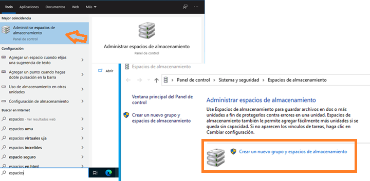

# AA2. Espais d'emmagatzematge a sistemes Windows

## Presentació de l'activitat

La informació és un dels actius més valuosos per qualsevol organització. La pèrdua d'informació pot tenir conseqüències molt negatives, per això és important disposar de sistemes de còpia de seguretat i de recuperació davant d'errors. En aquesta activitat es treballarà amb un sistema RAID (Redundant Array of Independent Disks) que permet combinar diversos discs durs per millorar el rendiment i la tolerància a fallades.

Tot i que en entorns reals els sistemes RAID solen ser gestionats per hardware dedicat, els sistemes operatius com Windows o Linux permeten configurar sistemes RAID per software. Aquesta gestió per software ha anat evolucionat i en el cas dels sistemes Windows, disposem d'una solució més avançada que són els "Storage Spaces" que permeten crear volums virtuals amb redundància i tolerància a fallades.

Els espais d'emmagatzematge van aparèixer a partir de Windows 8 i Windows Server 2012, i permeten crear volums virtuals amb redundància i tolerància a fallades. Aquests espais d'emmagatzematge poden ser configurats amb diferents nivells de redundància i són molt més flexibles que els sistemes RAID tradicionals, ja que per exemple, permeten anar afegint emmagzetmatge addicional a mesura que les necessitats de l'organització creixen.

Hi ha dos conceptes que no cal confondre:

- **Grup emmagatzematge**: és un conjunt de discs durs físics que s'utilitzen per crear espais d'emmagatzematge, el podem entendre com un contenidor de discos.

- **Espai d'emmagatzematge**: és un volum virtual creat a partir d'un grup d'emmagatzematge, el podem entendre com un disc dur virtual que inclou algun tipus de redundància. Un grup d'emmagatzematge pot contenir diversos espais d'emmagatzematge, i un espai d'emmagatzematge pot utilitzar diversos discs durs físics.

Els espais d'emmagatzematge permeten crear volums virtuals amb diferents nivells de redundància, com ara:

- **Simple**: sense redundància, similar a un RAID 0. El principal avantatge és disposar d'un volum que pot ser més gran que qualsevol dels discs durs físics que el componen. El principal inconvenient és que si un disc dur falla, es perd tota la informació.
- **Mirall doble**: amb redundància, similar a un RAID 1.
- **Paritat**: amb redundància, similar a un RAID 5, ja que utilitza un disc dur per emmagatzemar la informació de paritat. Requereix de tres discos.
- **Mirall triple**: amb redundància, similar a un RAID 1, però amb més tolerància a fallades, ja que manté tres còpies de la informació. Requereix de cinc discos i es basa a la tecnologia de "cluster quantum" [2](https://www.techtarget.com/whatis/definition/cluster-quorum-disk)

### Durada de l'activitat

La durada estimada de l'activitat és de 2 hores.

### Objectius de l'activitat

Entendre el funcionament dels espais d'emmagatzematge a Windows i la seva utilitat per millorar el rendiment i la tolerància a fallades.

### Competències treballades

n) Mantenir un esperit constant d’innovació i actualització en l’àmbit del sector informàtic.

### Resultats d'aprenentatge i criteris d'avaluació

RA2. Gestiona dispositius d'emmagatzematge descrivint els procediments efectuats i aplicant tècniques per assegurar la integritat de la informació.

2.2 Té en compte factors inherents a l’emmagatzematge de la informació (rendiment, disponibilitat, accessibilitat, entre d’altres)..

### Continguts

- Sistemes d'emmagatzematge redudants.
- Espais d'emmagatzematge a Windows.

### Capacitats clau

- Autonomia
- Organització del treball
- Resolució de problemes

## Enunciat de l'activitat

### Entorn de treball

Per aquesta activitat farem servir una màquina virtual Windows 11, amb les configuracions habituals de RAM, xarxa i emmagatzematge principal.

Abans de començar i la màquina apagada, caldrà crear **3 discs durs addicionals** a la màquina virtual, amb una mida de 10 GB cadascun, que serviran per crear l'espai d'emmagatzematge.

### Instruccions de l'activitat

### Administrador de discs

El primer pas un cop iniciem la màquina virtual és anar al "Administrador de discos", en entrar ens avisarà que detecta tres discos sense inicialitzar. Els podem inicialitzar amb el sistema de fitxers NTFS i amb l'estil de partició MBR.

### Administració d'espais d'emmagatzematge

A "Configuració" hi ha l'eina "Administració d'espais d'emmagatzematge"

Aquí és es creen els grups de volums i els espais.

### Espai Simple

1. Creem un grup d'emmagatzematge i afegim **dos** dels tres discos durs a aquest grup.
2. Definim un espai **simple** i definiu un espai superior al disponible del grup d'emmagatzematge. Assignem un nom i una lletra de unitat a l'espai.
3. Afegiu ara el tercer disc al grup d'emmagatzematge i observeu com podeu 

### Documentació i Informe Final

## Guia d'avaluació

|Criteri d'avaluació                                         | Puntuació |
|------------------------------------------------------------|-----------|

## Enllaços d'interès

1. [Xataka Windows. Así funciona la aplicación de Uso de almacenamiento de Windows 10](https://www.xatakawindows.com/windows/asi-funciona-la-aplicacion-de-uso-de-almacenamiento-de-windows-10)

2. [Tech Target. Cluster Quorum Disk](https://www.techtarget.com/whatis/definition/cluster-quorum-disk)
