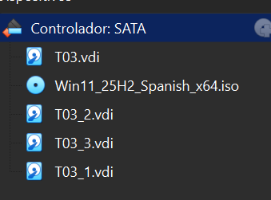
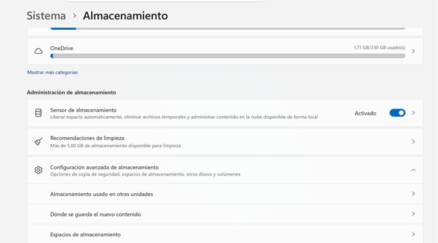
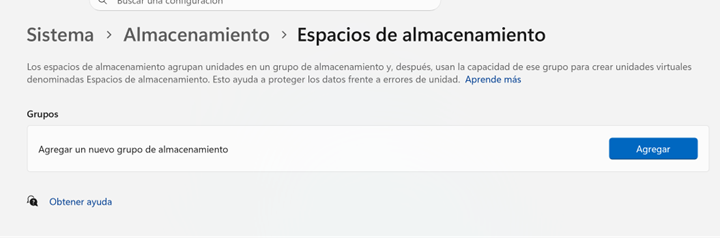
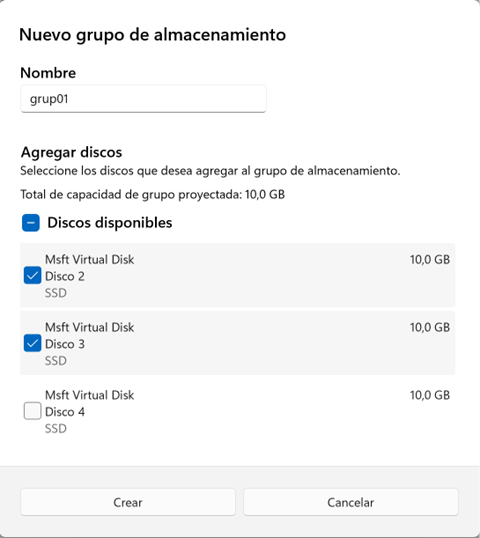
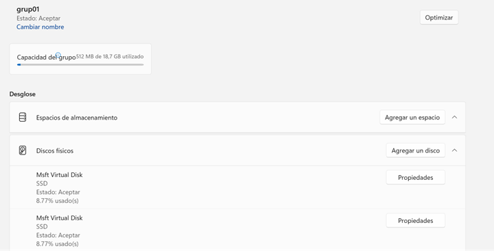
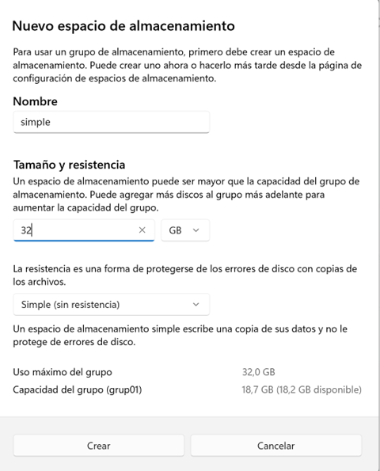
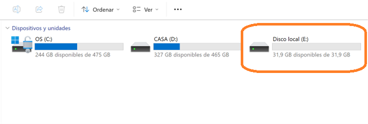
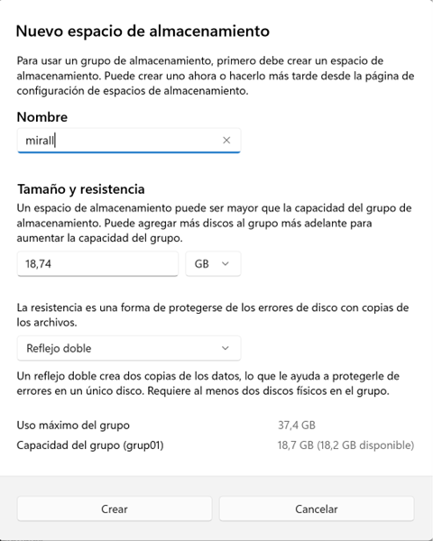
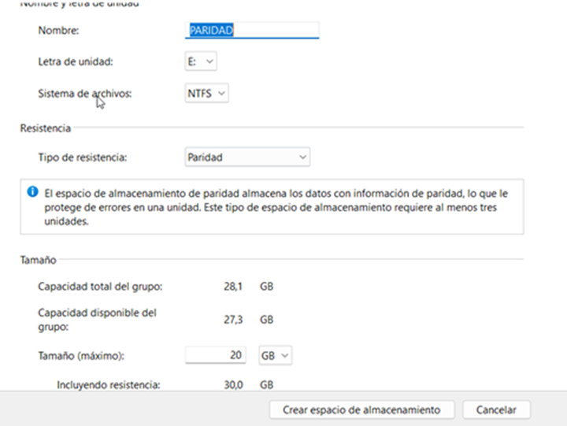
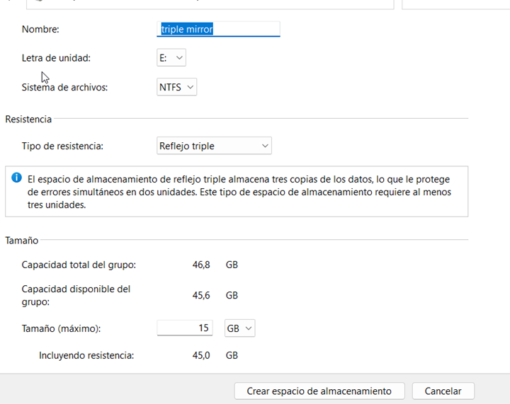

# Guia gestió d'espais d'emmagatzematge a Windows

## Introducció

Els espais d'emmagatzematge van aparèixer a partir de Windows 8 i Windows Server 2012, i permeten crear volums virtuals amb redundància i tolerància a fallades. Aquests espais d'emmagatzematge poden ser configurats amb diferents nivells de redundància i són molt més flexibles que els sistemes RAID tradicionals, ja que per exemple, permeten anar afegint emmagzetmatge addicional a mesura que les necessitats de l'organització creixen.

## Conceptes bàsics

- **Grup emmagatzematge**: és un conjunt de discs durs físics que s'utilitzen per crear espais d'emmagatzematge, el podem entendre com un contenidor de discos.

- **Espai d'emmagatzematge**: és un volum virtual creat a partir d'un grup d'emmagatzematge, el podem entendre com un disc dur virtual que inclou algun tipus de redundància. Un grup d'emmagatzematge pot contenir diversos espais d'emmagatzematge, i un espai d'emmagatzematge pot utilitzar diversos discs durs físics.

Els espais d'emmagatzematge permeten crear volums virtuals amb diferents nivells de redundància, com ara:

- **Simple**: sense redundància, similar a un RAID 0. El principal avantatge és disposar d'un volum que pot ser més gran que qualsevol dels discs durs físics que el componen. El principal inconvenient és que si un disc dur falla, es perd tota la informació.
- **Mirall doble**: amb redundància, similar a un RAID 1.
- **Paritat**: amb redundància, similar a un RAID 5, ja que utilitza un disc dur per emmagatzemar la informació de paritat. Requereix de tres discos.
- **Mirall triple**: amb redundància, similar a un RAID 1, però amb més tolerància a fallades, ja que manté tres còpies de la informació. Requereix de cinc discos i es basa a la tecnologia de "cluster quantum" [2](https://www.techtarget.com/whatis/definition/cluster-quorum-disk)

## Exemple pràctic sobre VM

### Creació del grup d'emmagatzematge

El primer pas és crear tants discos com siguin necessaris a la màquina virtual, inicialment, per exemple es crearan 3 discos de 10 GB.

Un cop iniciada la màquina, cal anar a **Administrador de discos** i inicialitzar els discos. En aquest cas, s'inicialitzen com a **MBR**.

> 💡**Alternativa**: es poden crear els discos virtuals directament des la màquina Windows, per fer-ho cal obrir un terminal PowerShell com administrador i per cada disc, executar la comanda: `New-VHD -Path ".ruta\nom_disc.vhdx" -SizeBytes 10GB -Dynamic` on "ruta" és la carpeta on es vol tenir els discos i "nom_disc" és el nom de cadascun dels discos.
>
> A continuació, cal executar la comanda `Mount-VHD -Path ".ruta\nom_disc.vhdx"` per muntar cadascun del disc virtual, amb `$disk = Get-Disk | Where-Object PartitionStyle -eq 'RAW` tenim un objecte amb tots els discos no inicialitzats i amb `$disk | Initialize-Disk -PartitionStyle MBR` inicialitzem tots els discos.

Un cop inicialitzats els discos, s'inicia la màquina i s'accedeix a **Sistema/Almacenamiento/Configuración avanzada de almacenamiento/Espacios de almacenamiento** per crear un grup d'emmmatgematge.

Apareixeran els discos disponibles per afegir al grup. Inicialment, se seleccionen dos dels tres discos. Els grups d'emmagatzematge se li poden afegir més discos en qualsevol moment.

En crear el grup ja apareix l'opció de crear un espai d'emmagatzematge a dins del grup, tot i que si es dona "cancel·lar" es pot crear més endavant.

Les opcions de gestió del grup d'emmagatzematge permet afegir més discos al grup, canviar el nom del grup, crear un espai d'emmagatzematge o eliminar el grup d'emmagatzematge i "optimitzar" que serveix per repartir les dades entre els discs del grup.

> 💡**Nota**: També es pot accedir a les mateixes funcions des del **Panel de control**, amb un menú d'estètica Windows clàssica, però progressivament Microsoft està substituint-lo per les opcions de **Configuració**.

### Creació d'un espai d'emmagatzematge simple

Aquest espai permet tenir un volum virtual que pot ser més gran que qualsevol dels discs físics que el componen, però no ofereix cap tipus de redundància. En cas de fallada d'un dels discs, es perd tota la informació.

Quan es defineix, es pot indicar que la mida del volum sigui més gran que la suma de les capacitats dels discs físics, ja que es pot afegir més emmagatzematge al grup en qualsevol moment i afegir quan sigui necessari més discs físics al grup. Un cop seleccionat, es procedirà a donar format i ja apareixerà com un volum al sistema.

Per elimiar l'espai d'emmagatzematge, cal anar a **Sistema/Almacenamiento/Configuración avanzada de almacenamiento/Espacios de almacenamiento**, seleccionar l'espai i donar-li a **Eliminar**. Aquesta acció no elimina el grup d'emmagatzematge ni els discs físics que el componen.

### Creació d'un espai d'emmagatzematge mirall doble

Aquesta estructura es comporta com un RAID 1, ja que manté una còpia de la informació en un altre disc. En cas de fallada d'un dels discs, la informació es manté intacta. Cal seleccionar el tipus de volum **Mirall doble** i assignar-li un nom i una lletra de unitat. També cal indicar la mida del volum, quan es fixa, també pot superar l'espai disponible, indicant l'espai real que es necessitarà.

Per comprovar la redundància, s'afegeix contingut al volum i es comprova que es pot accedir a la informació. A continuació, s'apaga la màquina virtual i es desconnecta un dels dos discos que formen part del grup d'emmagatzematge. En tornar a iniciar la màquina, es comprova que la informació és accessible i que el sistema indica que l'espai mirall està degradat.

Si s'afegeix ara el tercer disc al grup d'emmagatzematge, el sistema començarà a reconstruir la informació que s'ha perdut. Un cop finalitzada la reconstrucció, es pot comprovar que la informació és accessible i que el sistema indica que tots els discs estan correctes.

Finalment, es pot eliminar l'espai d'emmagatzematge mirall doble i comprovar que el volum ja no és accessible.

### Espai d'emmagatzematge amb paritat

Aquest model és similar a un RAID 5, ja que utilitza un disc per emmagatzemar la informació de paritat. Requereix de tres discs físics i permet que un d'ells falli sense perdre la informació. En cas de fallada d'un disc, el sistema indica que hi ha un disc amb problemes i comença a reconstruir la informació quan s'afegeix un nou disc al grup.

Són necessaris els tres discos, per tant, prèviament, cal tornar a connectar el segon disc que s'havia desconnectat. Un cop connectat, es pot crear un espai d'emmagatzematge amb paritat, indicant el nom i la lletra de unitat, així com la mida del volum.

### Espai d'emmagatzematge mirall triple

Aquest model és similar a un RAID 1, però amb més tolerància a fallades ja que suporta errors en dos discos, ja que manté tres còpies de la informació. Requereix de **cinc discos** físics i es basa en la tecnologia de "cluster quantum". En cas de fallada d'un disc, el sistema indica que hi ha un disc amb problemes i comença a reconstruir la informació quan s'afegeix un nou disc al grup.

## Enllaços d'interès

- [Xataka - Storage Spaces en Windows 10](https://www.xatakawindows.com/windows/asi-funciona-la-aplicacion-de-uso-de-almacenamiento-de-windows-10)

- [Microsoft Learn - Espais d'emmagatzematge a Microsoft](https://learn.microsoft.com/en-us/windows-server/storage/storage-spaces/overview)

- [TechTarget - Cluster Quorum Disk](https://www.techtarget.com/whatis/definition/cluster-quorum-disk)